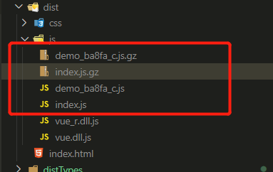
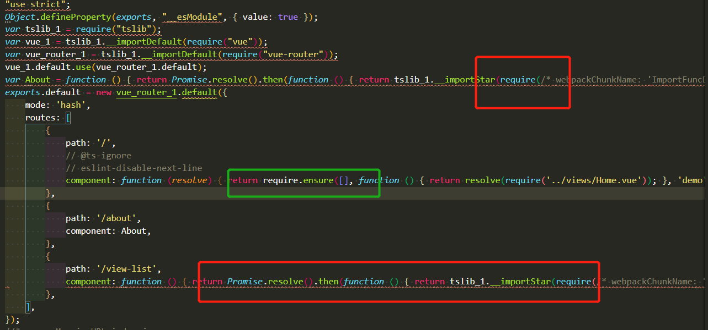
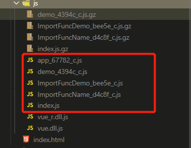

# Vue 与TS 的配置大坑
## 起因:
> 在不久前的一个小demo，使用webpack + ts + vue搭建了一个环境，在完事后发现打包的主入口文件太大，使用webpack的`optimization.splitChunks`拆分一下引入的包，但是，不尽人意，看了一下webpack文档和vue文件，又有了一个思路，从vue-router的路由懒加载下手，这时，问题就出现了


## 环境:
- webpack
- typescript
- vue
- vue-router
- babel

## 出现问题的地方
```js
{
    test: /\.ts$/,
    exclude: /node_modules/,
    use: [
        {
            // 这个线程中就一个babel-loader
            loader: 'happypack/loader',
            options: {
                id: 'babel',
            },
        },
        {
            loader: 'ts-loader',
            options: {
                appendTsSuffixTo: [/\.vue$/],
                appendTsxSuffixTo: [/\.vue$/],
            },
        },
        'eslint-loader',
    ],
},
```

看起来没啥问题
这里的逻辑就是eslint-loader校验源码后没问题交给ts-loader，ts-loader进一步转换ts语法为js语法，最后交给babel-loader完成最终的转换

但是，我们配置完后懒加载路由后
```js
const About = () => import(/* webpackChunkName: 'ImportFuncDemo' */ '../views/About.vue');
export default new VueRouter({
    mode: 'hash',
    routes: [
        {
            path: '/',
            // require方式进行懒加载
            component: resolve => require.ensure([], () => resolve(require('../views/Home.vue')), 'demo'),
        },
        {
            path: '/about',
            // import方式
            component: About,
        },
        {
            path: '/view-list',
            // import方式
            component: () => import(/* webpackChunkName: "ImportFuncName" */ '../views/ViewList.vue'),
        },
    ],
});
```
按下npm run build
;

import 的方式居然没有打包出来，难道webpack的魔法注释骗人？（怀着怀疑的态度读了几篇文章，又过了一遍Vue、webpack代码分割这篇文档任然没有什么苗头）

在更改了一些配置和代码后，仍然还是这样

没办法了吗？


## 思路出现

仔细分析了下，既然webpack的魔法注释是注释，难道是ts-loader中的compilerOptions.removeComments 给删了？

直接用tsc(typescript的cli工具)运行，打包出来后注释并没有影响，但是，仔细一瞅tsc编译过后的源码就有点奇怪了，


> 红色的是被更改过的，而require.ensure确实很坚强的没改变

根据这个线索往下找

## 答案初探
import 会被转换成require是因为tsconfig.json中配置的（`module`为none 默认值也会被转换为commonjs）
但是，import 到babel-loader那里才会被识别为动态的呀，你直接给整成require了，babel也不认这玩意呀

那咱们就那把module的值改成ESNext(支持转换为import的选项)，但是，问题又来了，ts-node直接执行build/prod.ts（打包的启动器）会导致prod.ts无法运行了，出现了下面的错误，也就是，不能用improt 语法了，你说气不气
```js
import webpack from 'webpack';
       ^^^^^^^
```

在思考一下，webpack入口以后的文件就不由ts-node来编译了，而是由ts-loader来编译，
ts-laoder编译的源码是和tsc编译的是一样的（已验证，在ts-loader源码的主入口函数中可以打印观看）那么ts-loader的配置会引用目录顶级的tsconfig.json，但是，这个顶级目录又不能更改，否则webpack都调用不起来

## 最终解决
在看一遍ts-loader的文档，可以自行引用一个配置（configFile(只能路径)），否则就使用最顶级的
```json
// tsconfig.prod.json
{
    "compilerOptions": {
        "target": "ESNext",
        "module": "ESNext",
        "lib": [
            "dom",
            "es5",
            "es6",
            "es7",
            "esnext"
        ],
        "strict": false,
        "moduleResolution": "node",
        "esModuleInterop": true,
        "allowSyntheticDefaultImports": true,
        "experimentalDecorators": true,
        "baseUrl": ".",
        "paths": {
            "client/*": [
                "client/*"
            ]
        }
    },
}
```


```js
// build/webpack.prod.conf.ts
{
    test: /\.ts$/,
    exclude: /node_modules/,
    use: [
        {
            loader: 'happypack/loader',
            options: {
                id: 'babel',
            },
        },
        {
            loader: 'ts-loader',
            options: {
                appendTsSuffixTo: [/\.vue$/],
                appendTsxSuffixTo: [/\.vue$/],
                configFile: path.join(__dirname, './tsconfig.prod.json'),
            },
        },
        'eslint-loader',
    ],
},
```
npm run build

;


至此，完美解决这一问题


有想模仿的朋友可以模仿环境试试
```ts
import express from 'express';
import path from 'path';
import webpackHotMiddleware from 'webpack-hot-middleware';
import webpackDevMiddleware from 'webpack-dev-middleware';
import webpack from 'webpack';
import DevConfig from './webpack.dev.conf';

let time = Date.now();
console.log('开始编译');
const complier = webpack(DevConfig as any);
console.log('编译完成', Date.now() - time, 'ms');
time = null;

const app = express();

app.use(webpackHotMiddleware(complier));
app.use(webpackDevMiddleware(complier));

app.use(
    express.static(path.resolve('public'), {
        maxAge: 60 * 60 * 24,
    })
);

app.use(
    express.static(path.resolve('dist'), {
        maxAge: 60 * 60 * 24,
    })
);
app.listen(12305);

```