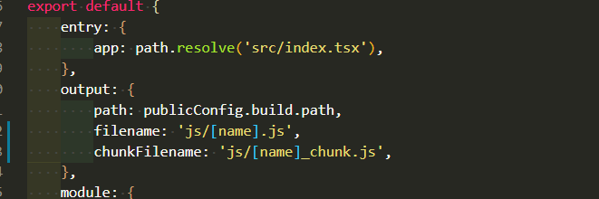
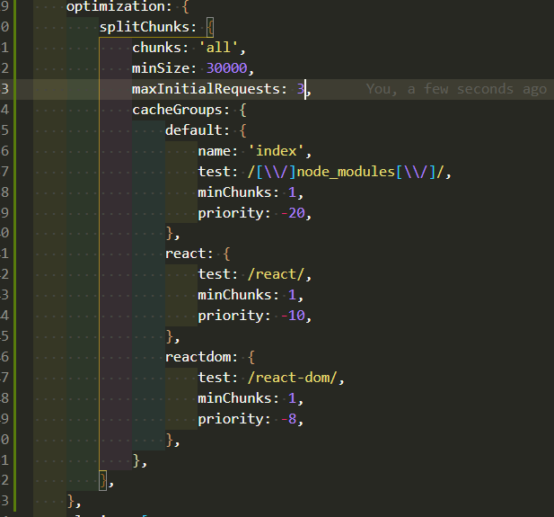
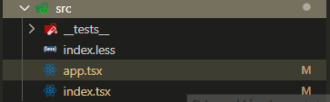
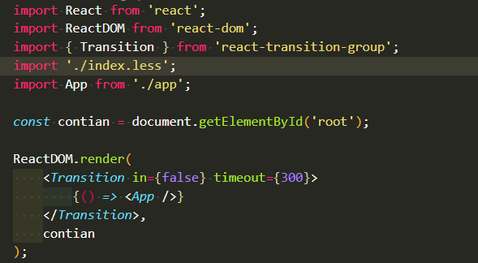
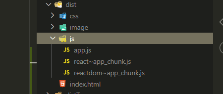
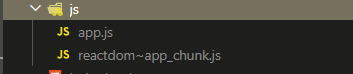
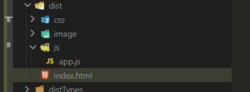
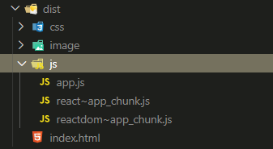
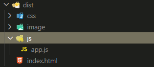
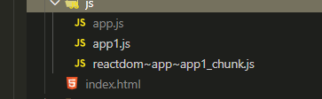

# 打包优化

## S场景
Vue项目，打包后单个包超过了1MB，一看打包后的文件，Vue，Vue-router，Vuex，Vuetify(ui框架)都打包在了一起，还有一个core-js@3的(项目原因需要全部引入)，包放在CDN中加载起来也不是很容易。

## T任务
分离大的代码包中的代码，然后放置到CDN中。

## A行动
已经在webpack.base.conf.ts中配置了optimization.splitChunks，然而效果并不大，并且之前已经了解过了splitChunks.cacheGroups，增对这个查阅官网资料，google，得到一点眉目

## R结果
匹配出node_modules里面的包，然后分割


```js
export default {
    optimization: {
        splitChunks: {
            // inital 入口的包， async 异步包， all 全部
            chunks: 'inital',
            // 单个入口中，最多只能打包出来n个chunk包，为1则只能打包一个默认包（全部打包在一起）当打包的包还差一个达到上限时，选择大的打包
            maxInitalRequests: 3,
            // 同理
            maxAsyncRequests: 5,
            // 如果几个包叠加在一起后超过了设定大小，那么就会继续拆，直到超过maxInitalRequests设定的数量，maxSize的限制也会相应的消失
            maxSize: 0
            // minChunks
            cacheChunks: {
                // cacheChunks也有默认值，vendors 和default
                /** 这个就是匹配出来的包的名字 */
                vue: {
                    // splitChunks的所有属性(除了cacheGroups)都可以在这里使用，不过这里还添加了一些附加属性，比如优先级

                    // name不存子则为key值，存在则为name
                    name: 'test1',
                    // 正则匹配
                    test: /vue/, 
                    // 优先级
                    priority: -10,
                    // 拆分前的最小引入次数，为1，则见到就引入
                    minChunks: 1,
                    // 如果包小于这个大小，那么也不会被引入
                    // 引入包的最小值， 默认30000
                    minSize: 30000,
                    
                },
                vendors: {
                    test: /[\\/]node_modules[\\/]/,
                }
            }
        }
    }
}


```


上面的属性并不是全部，但都是用来分割代码的关键属性（dog，如果还有，请补充）


# 截图
下面将奉上截图
> 图片配置只是示例，以react为实验对象是应为刚好建了这个环境

## 配置
**入口与出口**
> 


**optimization**
以下正常配置都指这个截图
> 


## 入口文件
**入口结构**
> 

**入口引入的包**
> 


## 实验maxInitalRequests的作用
**正常配置**
> 

**maxInitalRequests: 2时**
> 

**maxInitalRequests: 1时**
> 

可见，maxInitalRequests分离包的个数有了限制，但是要注意，它也只是对inital中的包产生作用，异步的则需另外一个属性

注意，如果包的大小超过了maxSize，那么包还是会持续拆分，不受maxInitalRequests的影响


## 实验maxChunks的作用
**正常配置**
maxChunks全部为1
> 

maxChunks全部为2
> 


也许上面的截图看不出来什么，我又添加了一个入口(第一个入口时src/index.tsx，第二个就不放截图了)，再次实验
> 

app为第一个入口
app1为第二个入口
reactDom~app~app1则是它们共同的包，而有差异的都被打包到app.js 或app1.js各自的入口中了，

可以说maxChunks限制了多个入口间引用同一个包(如两个包都引入了React)达到一定次数，才会提取到公共包中，打包后的html就都会引入这个公共包


## maxSize && minSize

minSize限制包的最低值，包如果不超过这个大小就不会被提取

maxSize限制包的最大值，当包提取后大于maxSize的值，就不会在往这个包中继续放置代码，而是另开一个包
